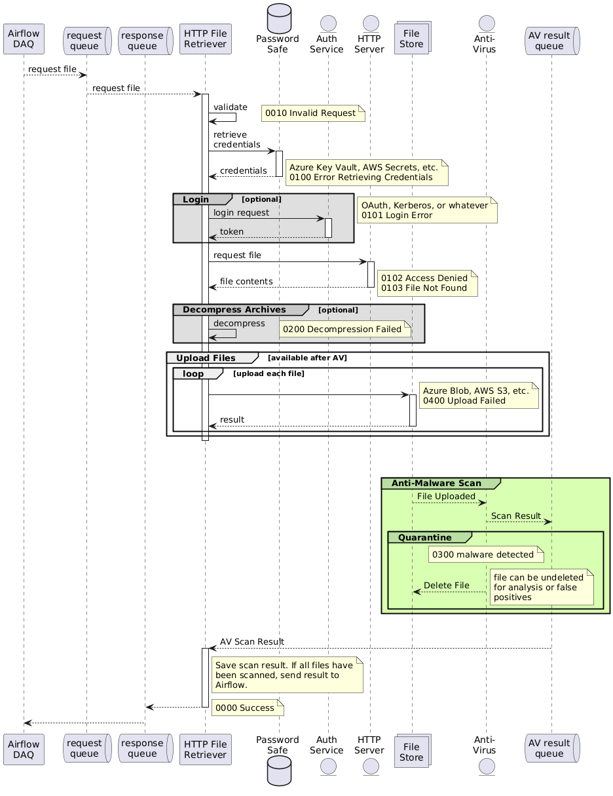

# HTTP File Retriever (http-file-rtrvr)
This tool will retrieve a file from an HTTP or HTTPS location. A general flow is shown just below.
 (see Note 1).

## Request Format
Requests should be sent as JSON.

    {
        "method": "GET",
        "url": "http://example.com/some/file",
        "timeout_seconds": 5
    }

The following fields are mandatory:
- url

The following fields are optional:
- method: defaults to GET. Valid options are GET or POST
- timeout_seconds: integer seconds, defaults to 5 seconds

## Exit Codes
Exit codes are broken into different series where 1xx are access failures, 2xx are file format failures, 3xx are concerns with file contents such as malware, 4xx indicates the files couldn't be uploaded to the staging area for dispatch for further processing (Airbyte), and 5xx indicates errors replying to the system which requested the file retrieval.

| Code | Meaning                                                     |
|------|-------------------------------------------------------------|
| 0000 | Success                                                     |
| 0010 | Invalid Request                                             |
| 0100 | Error Retrieving Credentials                                |
| 0101 | Login Error (OAuth failure, HTTP 401, etc.)                 |
| 0102 | Access Denied (HTTP 403)                                    |
| 0103 | File Not Found (HTTP 404)                                   |
| 0199 | Unknown Retrieval Error                                     |
| 0200 | Decompression failed (unsupported format, corrupted, etc.)  |
| 0300 | File, or embedded file, flagged by Anti-malware             |
| 0400 | Upload Failed                                               |
| 0500 | Response to source system (Airflow) failed                  |
| 9999 | Operation unsupported                                       |
[Exit codes]

Note 1: Interaction diagram was built using plant-uml. Remember to update this URL when you make edits. https://www.plantuml.com/plantuml/uml/ZLD1Rziy3BthLn3-hks7jDafXw7PkcB0Xgsek-wioamYJ14pYdBG_VhHgfDQRGxZoNb-VdnyPAwIM9Qy3GQZU7c2KalFgq1xgCiciCylAdBp-Vx-5cvyGBX3OOyzSZEGLmhT2VTiEYlsqIOiz5kRqfwuWzQki7dHTenTAyHOgo-pRA15xht3Pcf5yRPt9wmekLYOaCNo6kMLiFuuV_2SKrFFs1j78Q0JJp51KoOhnifKQMxC60ESdxz_cN81ZByp9YcGabIWjuAJ7DGp7M6AnXnVWIeT0r2bCSYF2WscRKX6iSmHt0IAf3hirninop-P4RxW4ppO7EGCbZzRQ57Paiu0nVrlPXUp6NnY9ZuioiSrJ5jWx63GD8PsybyOXDTids3oQ42hiZqkOW61rZuUGYYyqRBGBuo3-DJmzs6nP-gO7v59FHB3VcDbE9_1wWLyBNh5yCJPjFUurphvCQZo38wYO9GgAXM_XALpc19SO_JO3T3y-OI_aS0DvTZzSnZrKbUhLmdL9zAXe-sEjNL1JmYy3ce1iqlTs_NnGqyHRgmFQji4eXtOuP2tDkmj8oHdTNHYGEisBptgZVKBQ0jFqLCBAoBQAmTvwsQkRWxTEXHqSdIITu5iDtvPrDFRxcc-W1-5E66CZKU1kdLzuXy2FOxNFJySzZkrD4gMPARBUrQkHz22DfSBCAR34__KAnN8s_0N
